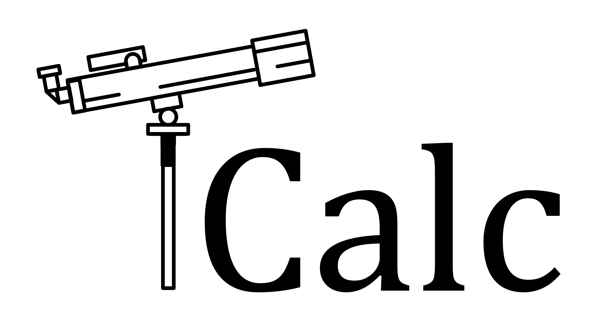

<!--  -->


# TCalc: Telescope-Calculator

[](https://badge.fury.io/py/TCalc)
[](https://tcalc.readthedocs.io/en/latest/README.html)
[](https://requires.io/github/Bhavesh012/TCalc/requirements/?branch=main)
[](https://opensource.org/licenses/MIT)
[](https://github.com/Bhavesh012/TCalc/actions/workflows/python-app.yml)

[](https://doi.org/10.5281/zenodo.5035311)
<!-- add badges from pypistats, travis.ci, coveralls.io -->

TCalc is built on the motive to spread awareness about telescopes and how to optimally use them in order to save time, money and sanity! Around 70% of amateur or rising astronomers and telescope owners waste 65% of their savings on buying the wrong or incompatible stuff for their telescope. 90% of them deals with high-level of frustration when trying their eyepieces or barlows.

With TCalc, we will be aiming to put this to an end! TCalc package provides the functionality to estimate 95% of the information about their telescope, and it's with just three parameters, aperture and focal length of telescope and eyepiece. With the input, the package will output all the information like maximum usable magnification, the smallest eyepiece that you can use and many more things such as focal-ratio, limiting magnitude, resolution power, etc. In TCalc, you can even create profiles of your telescope and eyepieces to simulate them in different ways. For advanced users, TCalc provides plots of resolution performance, eyepiece statistics for more detailed planning of their observations.

TCalc is written in Python and is compatible with every OS. It even works on phones too. TCalc package was pursued as a part of [Code/Astro Workshop 2021](https://semaphorep.github.io/codeastro/) by group 9. The authors of this package are: 


|Members|Bhavesh Rajpoot|Ryan Keenan|Binod Bhattarai|Dylon Benton|
|-----|-----|----|----|-----|

## Attribution

Please cite the DOI if you make use of this software in your research.
[](https://doi.org/10.5281/zenodo.5035311)

## Documentation

Docmentation is available [here.](https://tcalc.readthedocs.io/en/latest/?badge=latest) <!-- (http://radvel.readthedocs.io/) -->

## Features

With TCalc, you can

- *Estimation*
  - find various properties such as magnification, True FOV, etc., of your telescope
- *Saving*
  - save your favourite telescope configurations for later use
- *Simulation*
  - simulate the characteristics of your telescope for different optical accessories and scenarios 
- *Visualize*
  - creates plots of resolution performance and eyepiece statistics for advanced users
 

## Getting Started

### Installation

TCalc is a cross-platform python package and works on almost every OS. There are two ways to install the package:

#### Using `pip`

```python
pip install TCalc
```

#### Using GitHub

```python
git clone https://github.com/Bhavesh012/TCalc.git
cd TCalc
pip install -e .
```

### Basic Usage

```python
>>> from TCalc.tcalc import telescope, eyepiece
>>> my_telescope = telescope(D_o = 203.2, f_o = 2032)
>>> eyepiece1 = eyepiece(f_e = 25, fov_e = 52)
>>> my_telescope.add_eyepiece(eyepiece1,select=True)
>>> my_telescope.say_configuration()
```

```
Output:

The telescope has the following layout:
   Aperture diameter: 203.2 mm
   Focal length: 2032 mm, corresponding to a focal ratio of 10.0

In good atmospheric conditions, the resolution of the telescope (Dawes limit) is 0.6 arcseconds
By wavelength, the resolution is
   400 nm (blue): 0.5 arcsec
   550 nm (green): 0.7 arcsec
   700 nm (red): 0.9 arcsec

The maximum possible magnification factor is 406.4
This means the minimum compatible eyepiece focal length is 5.0 mm

The minimum magnification factor and corresponding maximum eyepiece focal length depend on the diameter of the observer's eye.
For a telescope user with an eye diameter of 7 mm (apropriate for an age around 25 years):
   The minimum magnification factor is 29.0
   This means the maximum compatible eyepiece focal length is 406.4 mm

The faintest star that can be seen by this telescope is 13.5 mag

The currently selected eyepiece is 'omni_25', which has the following layout:
   Focal length: 25 mm
   Field of view: 52 degrees

With this eyepiece:
   The magnification factor is 81.3. This is compatible with the telescope limits.
   The true field of view is 1 degrees
   The exit pupil diameter is 2.5 mm

The faintest surface brightness that can be seen by this telescope is 12.50
```

### Tutorials

You can find the base tutorial here: `TCalc\docs\tutorials\TCalc_tutorial.ipynb`
